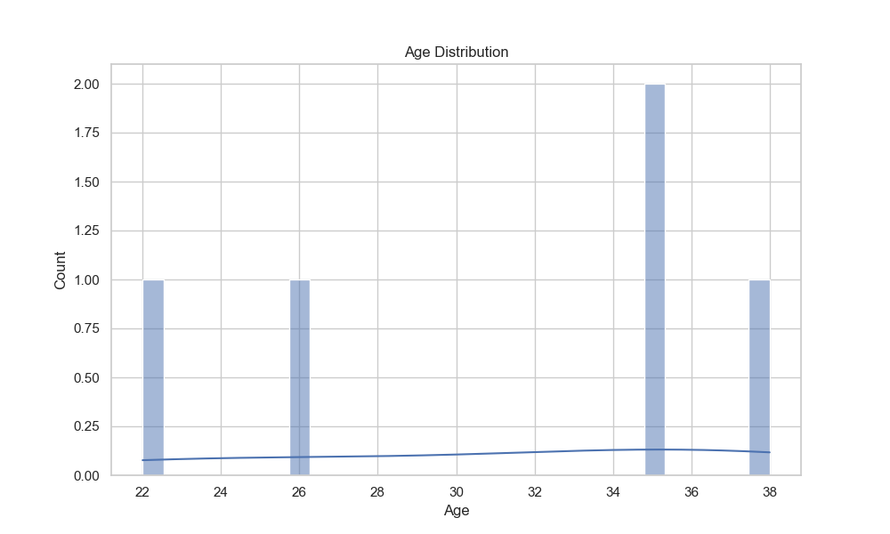

# 🚢 Titanic Dataset - Exploratory Data Analysis (EDA) Internship Project  
**Repository:** [GitHub - bugsnayan/CodeAlpha_EDA](https://github.com/bugsnayan/CodeAlpha_EDA)

## 🔰 Introduction

This project is part of the **CodeAlpha Data Analytics Internship**, where I, **Nayan**, have performed an **Exploratory Data Analysis (EDA)** on the widely-used **Titanic dataset**. The main aim of this task is to apply data analytics techniques to gain insights into passenger survival trends, clean the data, and visualize patterns using Python programming.

EDA is a crucial initial step in any data science or machine learning project as it helps us understand the data structure, detect anomalies, identify relationships, and summarize main characteristics. Through this project, I explore multiple aspects of the Titanic dataset such as gender, age, passenger class, and their impact on survival.

## 🧾 Dataset Description

The dataset used is **`titanic.csv`**, which includes detailed information about each passenger aboard the RMS Titanic. The attributes include:

- **Survived**: 0 = No, 1 = Yes  
- **Pclass**: Passenger class (1 = 1st, 2 = 2nd, 3 = 3rd)  
- **Sex**: Gender  
- **Age**: Passenger’s age  
- **SibSp**: Number of siblings/spouses aboard  
- **Parch**: Number of parents/children aboard  
- **Fare**: Ticket fare  
- **Embarked**: Port of embarkation (C = Cherbourg, Q = Queenstown, S = Southampton)

## 🛠️ Technologies and Tools Used

To analyze and visualize the data, I used the following technologies:

- **Python**: Main language for scripting
- **Pandas**: For data manipulation and loading CSV files
- **NumPy**: For numerical operations and filling missing data
- **Seaborn & Matplotlib**: For plotting graphs and creating visualizations

The entire script is written in `eda.py`, and cleaned data is saved as `titanic_cleaned.csv`.

## 📋 Step-by-Step Process

### 1. **Importing Required Libraries**

The necessary libraries like `pandas`, `numpy`, `seaborn`, and `matplotlib.pyplot` were imported. These libraries helped in loading data, cleaning, analysis, and visual representation of findings.

### 2. **Loading and Displaying the Dataset**

The dataset was read using `pd.read_csv()` and initial rows were displayed using `df.head()` to understand the structure. The data contained various fields that describe each passenger on board.

### 3. **Understanding the Dataset**

Using `df.info()` and `df.describe()`, I gathered summary statistics and the overall structure including column names, data types, number of null values, etc. This step helped identify missing data and determine the initial quality of the dataset.

### 4. **Handling Missing Values**

- The **'Age'** column had several missing values, which were filled using the **median** of the age column.
- Rows with missing **'Embarked'** values were dropped, as they were few and would not impact overall analysis.
- These steps ensured that no crucial analysis was skewed due to missing or null data.

### 5. **Framing and Answering Analytical Questions**

To derive insights from the data, I focused on answering key questions:

- **Q1. How many passengers survived?**  
  A simple value count of the `Survived` column gave the total number of survivors and non-survivors.

- **Q2. What is the survival rate based on gender?**  
  Grouping by `Sex` and computing the survival mean provided survival percentages for males and females.

- **Q3. How does age impact survival?**  
  Calculating the average age of survivors vs non-survivors helped understand age trends.

## 📊 Data Visualizations and Insights

### 1. **Survival Count by Gender**  
Using a countplot with `x='Sex'` and `hue='Survived'`, I visualized how many males and females survived.  
📌 **Insight**: A much higher proportion of females survived compared to males.

> 

### 2. **Age Distribution**  
A histogram plot showed the distribution of passenger ages with a KDE (Kernel Density Estimate) line for smoothing.  
📌 **Insight**: Most passengers were in their 20s and 30s, with a long tail of older individuals.

> 

### 3. **Passenger Class vs Age (Boxplot)**  
Using a boxplot, I analyzed how passenger class affected age distribution.  
📌 **Insight**: First-class passengers tended to be older on average compared to those in 3rd class.

> 

### 4. **Correlation Matrix (Heatmap)**  
A correlation heatmap was used to identify numeric correlations between features like age, fare, and survival.  
📌 **Insight**: Some features like `Pclass` and `Fare` had visible correlation trends with survival.

## 💡 Summary of Key Insights

- 🚺 **Gender Impact**: Females had a significantly higher survival rate than males.
- 👶 **Age Factor**: Younger passengers had a slightly better chance of survival.
- 💼 **Class Influence**: Passengers in higher classes (especially 1st class) had better survival outcomes.
- ❗ **Data Quality**: Missing values in the dataset were handled carefully to maintain accuracy.

## 🖥️ How to Run This Project

1. **Clone the Repository**  
   Use Git to download the repository locally.
   ```bash
   git clone https://github.com/bugsnayan/CodeAlpha_EDA.git
   cd CodeAlpha_EDA
   ```

2. **Install Required Libraries**  
   If libraries are not installed, use:
   ```bash
   pip install pandas numpy matplotlib seaborn
   ```

3. **Run the EDA Script**
   ```bash
   python eda.py
   ```

This will output the insights in the terminal and display visual plots.

## 📁 Output Files

- `titanic_cleaned.csv`: The cleaned version of the original dataset.
- `Figure_1.png`: Survival count by gender.
- `Figure_2.png`: Age distribution of passengers.
- `Figure_3.png`: Age distribution across passenger classes.

## 👨‍💻 Author

- **Name**: Nayan  
- **GitHub**: [@bugsnayan](https://github.com/bugsnayan)  
- **Internship**: CodeAlpha - Data Analytics Internship

## 📜 License

This project is developed for educational and internship purposes only.  
You may reuse the code or data for learning purposes with proper credit.
